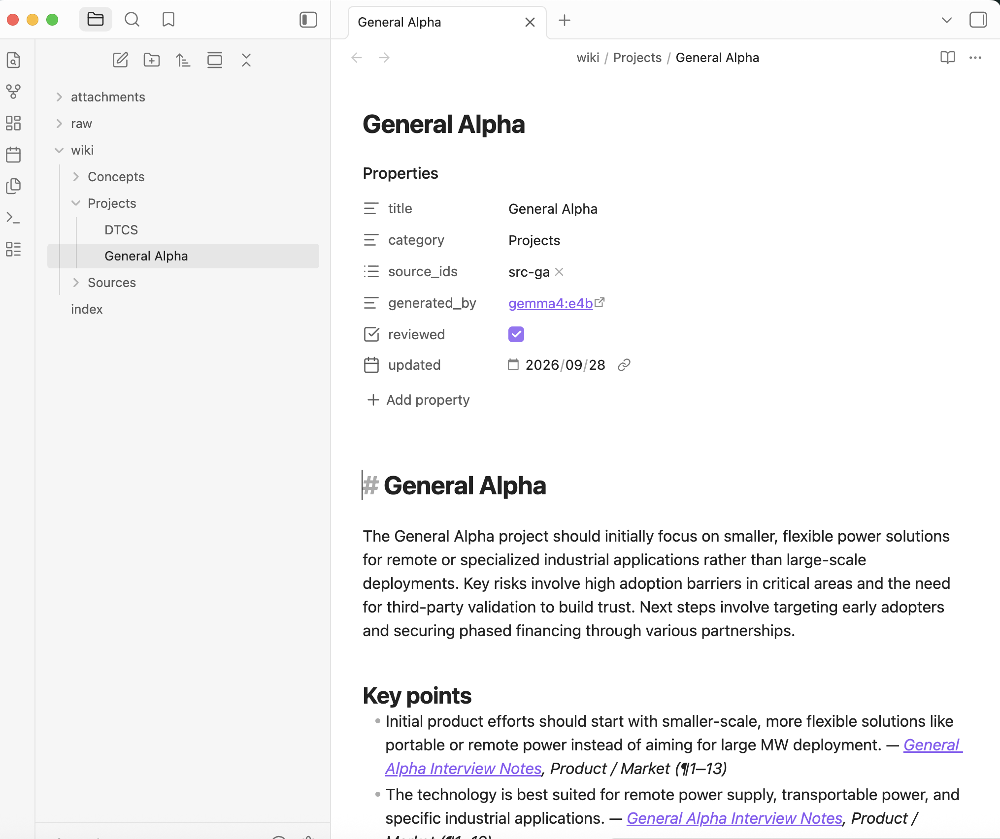
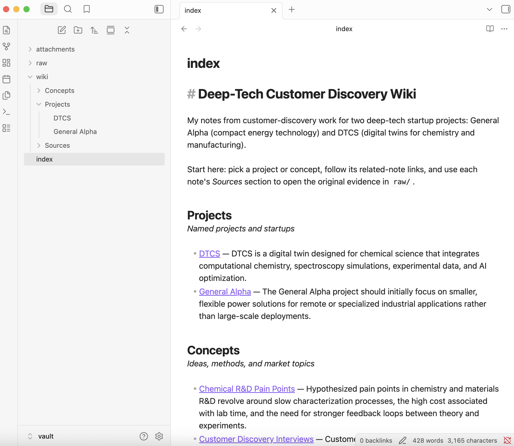
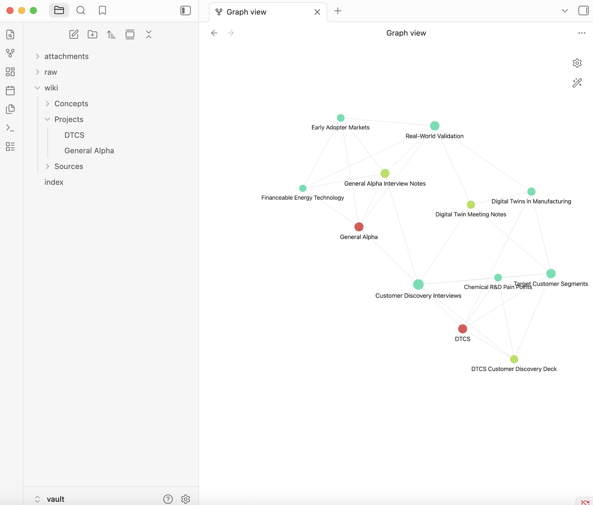

# Personal Wiki CLI — Local Gemma + RAG

A command-line personal wiki that runs **fully offline** on a MacBook Air (M4, 24 GB). Local
**Gemma 4 E4B** (via Ollama) turns my customer-discovery notes into a linked Obsidian wiki and powers
three modes through a harness I wrote: **chat** (personal assistant), **ask** (cited factual answers),
and **search** (original passages, no model).

| | |
|---|---|
| CLI + harness code | [`wiki_cli/`](wiki_cli/) · launcher [`./wiki`](wiki) |
| Wiki (open `vault/` in Obsidian) | [`vault/index.md`](vault/index.md) · [`vault/wiki/`](vault/wiki/) · originals [`vault/raw/`](vault/raw/) |
| Instructions loaded per mode | [`prompts/wiki-instructions.md`](prompts/wiki-instructions.md) (ask) · [`prompts/persona.md`](prompts/persona.md) (chat) · [`prompts/ingest-*.md`](prompts/) |
| Four ask-mode evidence cards | [Test 1](evidence/ask/test1-direct.md) · [Test 2](evidence/ask/test2-paraphrased.md) · [Test 3](evidence/ask/test3-two-sources.md) · [Test 4](evidence/ask/test4-unanswerable.md) |
| Chat / search mode checks | [`evidence/modes/mode-checks.md`](evidence/modes/mode-checks.md) · [chat transcript](evidence/chat/) · [error handling](evidence/modes/error-handling.txt) |
| Offline demonstration | [terminal log](evidence/offline-run/terminal-log.txt) · [memory samples](evidence/offline-run/memory-samples.txt) · [screen recording (48 MB download)](https://github.com/MinjunZang/personal-wiki-local-gemma/raw/main/evidence/offline-run/offline-demo.mp4) |
| Test questions (written before building) | [`tests/questions.md`](tests/questions.md) (outside the vault, so retrieval can't find the answer key) |
| Development logs | [wiki generation & review](docs/wiki-review.md) · [ask/chat/search development](docs/ask-chat-development.md) · [setup notes](docs/setup-notes.md) |

---

## 1. Purpose and sources

**What the wiki is for:** my customer-discovery work for two deep-tech startup projects this semester —
**General Alpha** (a compact energy technology) and **DTCS** (Digital Twin for Chemical Science). It should
answer questions like *which markets to try first, what evidence customers need, who to interview*.

| source_id | Original in `vault/raw/` | Format | Language |
|---|---|---|---|
| `src-ga` | `General Alpha 0928.docx` | Word — interview findings, GTM strategy, draft interview questions | English (+ a few Chinese notes) |
| `src-dtcs` | `DTCS_Lean_Transfer_Customer_Discovery.pptx` | 5-slide deck — segments, pain points, business model canvas, interview plan | English |
| `src-dt` | `数字孪生在制造业中的应用与访谈安排_Summary_202609150939_LectMate.doc` | Meeting summary (Markdown inside Word-HTML) — digital twins in manufacturing | Chinese |

**Privacy:** this repo is public, so before freezing the sources I replaced other people's names with roles
(e.g. "Finance Advisor") in the copies in `vault/raw/`; the private originals are git-ignored.
Details and SHA-256 hashes: [`docs/source-catalog.md`](docs/source-catalog.md).

**How originals connect to generated pages:** `raw/` file → one **source note** in `wiki/Sources/`
(summary, section list, link to the file) → **topic notes** in `wiki/Projects/` and `wiki/Concepts/`, where
every key point ends with *[[source note]], exact location* (e.g. `Commercialization (¶23–29)`, `Slide 3`).
Machine IDs (`source_id`, hash) live in note frontmatter and [`catalog.json`](catalog.json), never in filenames.

## 2. Setup and device

| Item | Value |
|---|---|
| Device | MacBook Air (Mac16,12), **Apple M4** — 10-core CPU (4P + 6E), 10-core GPU |
| Memory | **24 GB unified memory** (CPU and GPU share it; no dedicated VRAM) |
| Available memory | ~60% free when idle; 29–31% free during the offline run with other apps + screen recording open |
| Disk | 926 GB, ~361 GB free |
| OS | macOS 15.7.3 |
| Runtime | **Ollama 0.34.4** (Homebrew), local HTTP API on `localhost:11434` |
| Chat / generation model | **`gemma4:e4b`** (Ollama ID `c6eb396dbd59`) — Gemma 4 E4B instruction-tuned, **Q4_K_M** quantization, 9.6 GB download (includes vision/audio parts), 8.0B total / ~4B effective parameters, Apache 2.0 — source: https://ollama.com/library/gemma4 |
| Embedding model | **`embeddinggemma`** (ID `85462619ee72`) — 308M params, BF16, 768-dim, multilingual, 621 MB — https://ollama.com/library/embeddinggemma |
| Python | 3.14.7 in `.venv`: `python-docx 1.2.0`, `python-pptx 1.0.2`, `rank-bm25 0.2.2`, `numpy 2.5.3` |

### Why E4B at Q4_K_M
- E4B loads as **3.2 GB** (measured with `ollama ps`, 100% on GPU, 8,192-token context) — on 24 GB unified
  memory that leaves plenty for macOS, Obsidian, embeddings (0.68 GB) and retrieval.
- E2B would also fit, but E4B is still fast (~26 tokens/s) and my sources include Chinese text and
  cross-document questions, where the larger model is more reliable.
- 26B A4B MoE (~14.4 GB at Q4) would fit but be tight with other apps open; it activates ~4B parameters
  per token but must load all 26B weights. Not needed for a 3-source wiki.

### Measured on this device

| What | Result |
|---|---|
| Model load (cold) | 6.6 s |
| Generation speed | ~26 tokens/s (thinking mode **off**; with it on, a one-sentence reply took 19 s vs 2.3 s) |
| Memory while running | `gemma4:e4b` 3.2 GB + `embeddinggemma` 0.68 GB (both 100% GPU); CLI process < 65 MB |
| Full ingestion, 3 sources → 15 notes (first run) | 362 s (16 model calls) |
| Regenerate 12 notes with reviewed plan | 248.5 s |
| **Offline** forced re-ingest of one source (6 notes, reviewed notes kept) | **138.4 s** |
| Re-ingest, nothing changed | 1.5 s (skips all sources, rebuilds search index) |
| **Offline ask** answers (wall clock incl. CLI start + retrieval) | **11.6 s, 14.2 s, 21.1 s, 11.9 s** (≈1.9–2.5k prompt tokens each) |
| Offline chat turns | 5.4–21.5 s |

### Install (while online)

```bash
brew install ollama
brew services start ollama
ollama pull gemma4:e4b
ollama pull embeddinggemma
git clone https://github.com/MinjunZang/personal-wiki-local-gemma.git && cd personal-wiki-local-gemma
python3 -m venv .venv
.venv/bin/pip install python-docx==1.2.0 python-pptx==1.0.2 rank-bm25==0.2.2 numpy
chmod +x wiki
./wiki ingest vault/raw     # builds the search index in data/ (the reviewed notes are kept)
```

Model weights are **not** in this repo — download them with the two `ollama pull` commands.
(I use the `./wiki` launcher instead of `pip install -e .`: on this Mac the editable-install `.pth` file kept
getting the macOS "hidden" flag, which Python 3.14 skips.)

### Commands

```text
./wiki --help                                  # commands, configuration, required inputs
./wiki ingest vault/raw                        # read sources → Gemma → notes, index.md, search index
./wiki ingest "vault/raw/General Alpha 0928.docx" --force   # regenerate one source (keeps note names)
./wiki search "pilot projects" [--kind source|wiki|all] [--keywords]   # passages only, no model
./wiki ask "Why shouldn't General Alpha go after hospitals first?" [--save NAME]
./wiki chat                                    # Scout; in chat: /notes <topic>, /reset, /save <name>, /exit
./wiki check                                   # broken links, heading/filename mismatch, duplicates
```
`--mode local` is the default for `ask` and `chat`; `--mode online` is **not implemented** (it prints an error).

## 3. Architecture

| Piece | What it is here | Code |
|---|---|---|
| **Model** | Gemma 4 E4B served by Ollama on localhost. Generates text only from what the harness sends; it reads no files and remembers nothing. | [`llm.py`](wiki_cli/llm.py) |
| **Retrieval tool** | Local index of passages (from `raw/` and `wiki/`) + hybrid search: BM25 keywords + embeddinggemma vectors, merged with Reciprocal Rank Fusion. Returns passages with file path and location. | [`retrieval.py`](wiki_cli/retrieval.py), [`sources.py`](wiki_cli/sources.py) |
| **RAG workflow** | ask mode: retrieve → put passages + research rules in the prompt → Gemma answers from them → check citations. | [`harness.py`](wiki_cli/harness.py) `ask()` |
| **Harness** | Everything around the model: mode selection, loading the right instructions, conversation history, deciding when chat retrieves, prompt assembly, model calls, citation checks, errors, and saved outputs. | [`harness.py`](wiki_cli/harness.py), [`ingest.py`](wiki_cli/ingest.py) |
| **CLI** | The terminal interface: parses commands, prints results, writes evidence cards and transcripts. | [`cli.py`](wiki_cli/cli.py) |

### One question traced through the code: `./wiki ask "What kind of pilot projects…?"`

1. `./wiki` runs `python -m wiki_cli.cli` → `main()` parses the command → `cmd_ask()` → `require_local()`
   rejects anything but local mode.
2. `harness.ask()` → `llm.ensure_model()` (clear error if Ollama is down — otherwise a dead model would look like
   "no evidence") → `Retriever()` loads `data/chunks.json` + `data/embeddings.npy` and builds BM25.
3. `Retriever.search(question, k=8, kinds=("source",))` — only **original source passages**: tokenise
   (English words + Chinese bigrams) → BM25 scores → embed the question with embeddinggemma → fuse ranks. A passage
   in a different language from the question is scored by embedding rank only (BM25 cannot see it).
4. **Gate 1:** if the best cosine < 0.30, answer "insufficient evidence" without calling Gemma.
5. Prompt assembly: system = `prompts/wiki-instructions.md` (research rules); user = the question + passages
   `[S1]…[S8]`, each with note title, location and file. **No chat history and no persona.**
6. `llm.chat_json()` → `POST localhost:11434/api/chat` (`think: false`, temperature 0.1, JSON schema
   `{answer_found, answer, missing}`).
7. `check_citations()` finds every `[S#]`; unknown labels are flagged. **Gate 2:** an answer with no valid citation
   is replaced by "insufficient evidence".
8. `render_ask()` prints the answer, the cited file + location for each citation, and the retrieved-but-uncited
   passages; `log_run()` appends the full record to `evidence/runs.jsonl`; `--save` writes an evidence card.

### How chat differs
`ChatSession.reply()` sends `prompts/persona.md` + the last **10 messages** + the new message. It retrieves notes
**only if** the message mentions a wiki subject (note titles, "General Alpha", "DTCS", "digital twin"…) or a
phrase like "my notes", or the user types `/notes <topic>`; only passages with cosine ≥ 0.45 are passed on.
History stores plain text only — retrieved passages are never stored as "memory", and **ask never reads chat
history**, so something said in chat can't become evidence. `/save` writes a reply to `drafts/` (outside the
vault), labelled as a generated draft.

### Ingestion (`./wiki ingest`)
1. Read each file in `raw/` into located sections (`.docx` paragraphs ¶, `.pptx` slides, Markdown headings).
2. **Plan:** source text + `prompts/ingest-source.md` → Gemma → source title, summary, 2–4 topics (+ existing
   titles so it reuses them). Saved in `catalog.json`.
3. Chunk + embed all sources. For each topic, pick the 6 best passages (at least one per contributing source).
4. **Write:** passages + `prompts/ingest-topic.md` → Gemma → summary, points (each with a passage label), related
   notes. The harness drops points citing unknown passages, repeats, and untranslated Chinese; keeps only links to
   real notes; flags doubtful citations for review; renders the Markdown with source references.
5. Source notes, `index.md` (grouped by Projects / Concepts / Sources) and the search index are rebuilt.

**No duplicates on re-ingest:** a source whose hash is unchanged reuses its saved titles; notes marked
`reviewed: true` are never overwritten (the new draft goes to `data/drafts/`). Tested in
[`evidence/reingest-duplicate-test.txt`](evidence/reingest-duplicate-test.txt) and again offline: 12 notes before
and after, contents unchanged, `./wiki check` 0 problems.

## 4. Design choices

- **Passage size:** sections are merged if < 200 chars and split at 1,200 chars (~250–300 tokens), keeping the
  location. 23 source passages + 50 wiki passages. Ask sends **8 passages** (≈8–10k chars, ~2–2.5k tokens) +
  rules; the context is set to 8,192 tokens. Ingestion sends one whole source (≤ 7k chars) for planning and 6
  passages per note.
- **Retrieval:** hybrid, because BM25 alone cannot match an English question to the Chinese meeting notes, and
  embeddings alone are weaker on exact terms like "kWh". Both run locally; search works with keywords only if
  Ollama is stopped.
- **Research rules vs personality:** kept in separate files and loaded only by their mode. Ask: neutral, cite
  every claim, never guess numbers, say what's missing, interview *questions* are not facts, compare sources
  explicitly. Chat: "Scout", warm and brief, accurate capability list, suggestions labelled, no invented personal
  facts.
- **Model settings that mattered:** `think: false` (8× faster, no quality loss seen for these tasks);
  temperature 0.1 (ask), 0.2 (ingest), 0.6 (chat); JSON schemas for ask/ingest; 8 instead of 6 passages (fixed
  Test 3 attribution).
- **Note names & folders:** short subject names matching the first heading (`General Alpha.md`,
  `Real-World Validation.md`); folders `Projects/`, `Concepts/`, `Sources/`; raw filenames and IDs only in
  metadata. Retrieval chunks, embeddings, logs and tests live outside the vault.

## 5. Evidence

All graded runs: **2026-09-29 09:39–09:43 PDT, Wi-Fi off, `gemma4:e4b` Q4_K_M + `embeddinggemma`, local mode,
the three sources above.**

### Four ask-mode tests (offline)

| Test | Question | Expected source | Retrieved (rank) | Result |
|---|---|---|---|---|
| [1 · direct](evidence/ask/test1-direct.md) | What kind of pilot projects would reduce customer adoption risk for General Alpha? | src-ga Commercialization | ✔ #1 | **PASS** — small-scale pilots with state governments, universities, public entities, corporate R&D [S1] |
| [2 · paraphrased](evidence/ask/test2-paraphrased.md) | Why shouldn't General Alpha go after hospitals and data centers as its first customers? | src-ga "Defer for Later" + Key Risks | ✔ #1, #3 | **PASS** — need an established track record and proven reliability [S1]; long-term / high-barrier markets [S2] |
| [3 · two sources](evidence/ask/test3-two-sources.md) | Which customer segments does DTCS plan to interview, and does the digital twin meeting agree? | src-dtcs slides 2/5 + src-dt (Chinese) | ✔ Chinese #1, slide 5 #2, slide 2 #8 | **PARTIAL** — both lists correct and correctly cited, but "they agree" is never stated |
| [4 · unanswerable](evidence/ask/test4-unanswerable.md) | What price per kWh did General Alpha quote to its pilot customers? | none (only "$ per kWh" as a metric) | distractors retrieved as predicted | **PASS** — "Insufficient evidence in the wiki"; no number invented, even after the price was claimed in chat |

Each card contains the exact passages Gemma received, the full terminal output, and a claim-by-claim check of
every citation against the original.

### Chat / search mode checks (offline)
[`evidence/modes/mode-checks.md`](evidence/modes/mode-checks.md): capability questions answered without a notes
lookup or refusal; a plan draft that looked up notes and cited them; "make that shorter" used the conversation;
a price claimed only in chat was not used by ask; search returned original passages with no model call.

### Offline demonstration
- Script: [`tests/run_offline_demo.sh`](tests/run_offline_demo.sh) — refuses to run if the internet is reachable,
  restarts Ollama, then runs help → ingest → check → search → chat → the four ask tests.
- Output: [`evidence/offline-run/terminal-log.txt`](evidence/offline-run/terminal-log.txt) (starts with
  `Wi-Fi Power (en0): Off` and `curl: (6) Could not resolve host: www.google.com`).
- **Screen recording:** [⬇ download / play `offline-demo.mp4` (48 MB)](https://github.com/MinjunZang/personal-wiki-local-gemma/raw/main/evidence/offline-run/offline-demo.mp4)
  — GitHub can't preview a video this large in the page, so the link downloads it directly.
  (6 min, 720p, compressed from the 318 MB original) — Wi-Fi is switched off on camera, then the script runs
  ingestion, check, search, the chat checks and all four ask tests. The terminal log above is the same run as text.

### Obsidian screenshots
Vault opened at `vault/`. Graph filter: `path:wiki/`, attachments hidden, colour groups Projects / Concepts / Sources.

| Open note with source references | Index / page list | Graph view |
|---|---|---|
|  |  |  |

**Trace example:** `index.md` → [[General Alpha]] → related [[Real-World Validation]] → point *"Reliability, uptime,
and lifetime must be demonstrated using real-world pilot operating data"* → [[General Alpha Interview Notes]],
`2. Key Risks Identified (¶35–42)` → `raw/General Alpha 0928.docx`, paragraph 39.

## 6. Reflection — failures and limitations

**Biggest real failure: cross-language retrieval.** For Test 3 the Chinese meeting passage was the **#1 match by
embeddings (cosine 0.599)** but **fell out of the top 10** after fusing with BM25, because keyword search scores
Chinese text as 0 for an English question — the fusion treated "invisible to BM25" as "irrelevant". My first fix
overcorrected (all top 6 became Chinese). The final rule — score cross-language passages by embedding rank only —
works, but even then the slide that names DTCS's segments enters only at rank 8, and with 6 passages Gemma
**attributed the meeting's categories to the DTCS project**. Test 3 still doesn't state the comparison explicitly.
**Improvement I'd try next:** translate each passage (or a summary) into English at ingest time and index both,
so BM25 can match either language, then add a per-source quota in retrieval so every relevant source gets ≥ 2
passages.

Other failures recorded honestly (details in [`docs/`](docs/)):
- The first generated wiki had untranslated Chinese points, a sentence repeated 4× with wrong citations, no
  project notes, and word-overlap links — fixed by prompt and harness changes plus human review.
- An automatic "move the citation to the most similar passage" check was **wrong 5 of 6 times** (slides in one
  deck share vocabulary); it now only flags citations for a human.
- Chat invented "[S1], [S2]" markers once (copied from the persona's example); with Ollama stopped, `ask` first
  reported "insufficient evidence" instead of "model not running". Both fixed and re-tested.
- Small-model limits remain: occasional LaTeX arrows (`$\rightarrow$`) in chat, one missing citation in a chat
  draft, and generated notes that needed human corrections before being marked `reviewed: true`.

## 7. Online mode
Not implemented. `--mode online` exits with an error; everything above runs locally.
